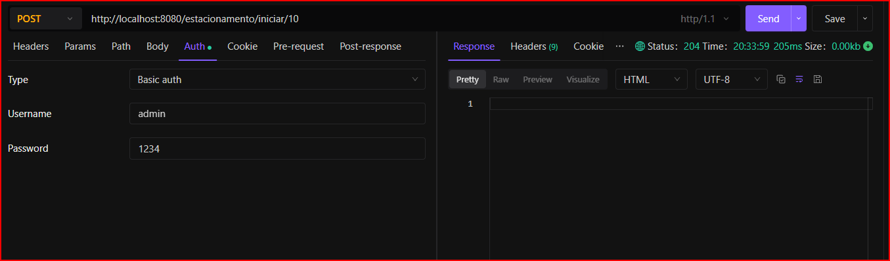
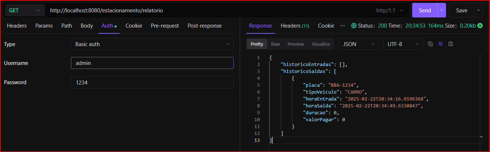
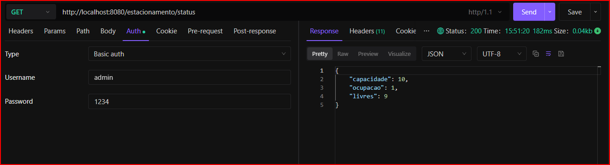
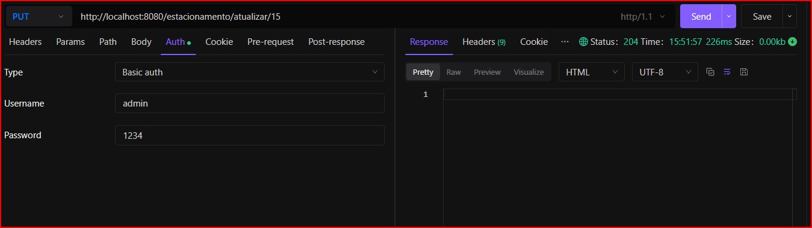
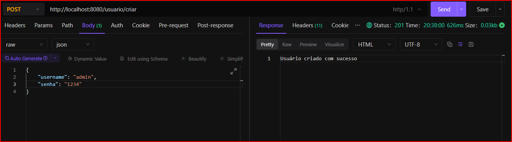
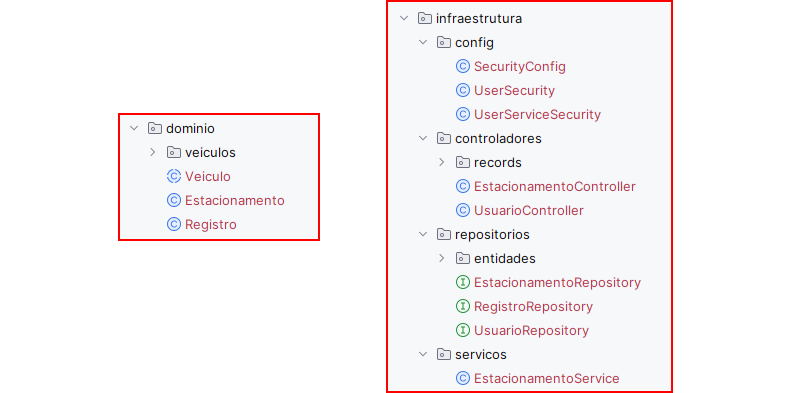

# ADA Estacionamento - Programação Web II

## Descrição
Projeto de estacionamento para a disciplina de Programação Web II

---
## Objetivo

- Aplicar o conhecimento adquirido sobre Programação Web II
- Aplicar o conhecimento sobre Spring Boot Web para expor endpoints de uma API Rest
- Aplicar o conhecimento sobre Spring Data JPA para persistência dos dados
- Aplicar o conhecimento sobre Spring Security para autenticação básica dos usuários
- Aplicar o conhecimento sobre Beans Validation para validar os dados recebidos nos endpoints
- Ler e interpretar enunciados.

---
## Enunciado

### Requisitos
Criação de uma API Web Rest para controlar veículos em um estacionamento.

 O sistema deve ser capaz de:

  - Inicializar o estacionamento com um limite de vagas
  - Permitir a entrada de veículos no estacionamento
  - Permitir a saída de veículos do estacionamento
  - Controlar o tempo de permanência de cada veículo no estacionamento
  - Controlar a lotação do estacionamento
  - Calcular o valor a ser pago pelo cliente baseado no tipo de veículo
  - Exibir um relatório com as informações de todos os veículos que passaram pelo estacionamento
  - Exibir o estado do estacionamento (capacidade, vagas disponíveis e ocupadas)
  - Gerenciar a capacidade do estacionamento, possibilidade de aumentar ou diminuir a capacidade
  - Ser extensível para adicionar novos tipos de veículos
  - Permitir o cadastro de usuários para acesso à API
  - Usar autenticação básica para acesso às funcionalidades

### Regras de Negócio

> **RN1** - Todos os endpoints devem ser protegidos por autenticação.

> **RN2** - Por questões didáticas, o endpoint para cadastrar usuários deve ser publico.
 
> **RN3** - O estacionamento possui um limite de vagas que deve ser informado no momento da inicialização.

> **RN4** - O estacionamento não deve permitir a entrada de veículos quando estiver lotado.
 
> **RN5** - O estacionamento deve permitir apenas veículos do tipo Carro e Moto.

> **RN6** - O estacionamento possui um valor fixo primeira hora e um valor para cada hora adicional baseado no tipo de veículo.
> - Carro: R$ 5,00 para a primeira hora e R$ 6,00 para hora adicional.
> - Moto: R$ 3,00 para a primeira hora e R$ 4,00 para hora adicional.
>
> 
> **Exemplo de cálculo de valor a ser pago:**
>  
> De 0 a 5 minutos não é cobrado nenhum valor.  
> Acima de 5 minutos é cobrado o valor de uma hora.  
> Acima de 1 hora é cobrado o valor de uma hora e mais o valor da hora adicional.
> 
>  **Exemplo 1:** 1h e 4 minutos = R$ 5,00 (1 hora) + R$ 6,00 (4 minutos) = R$ 11,00.  
>  **Exemplo 2:** 1h e 59 minutos = R% 5,00 (1 horas) + R$ 6,00 (59 minuto) = R$ 11,00.  
>  **Exemplo 3:** 2h e 1 minuto = R$ 5,00 (1 hora) + R$ 6,00 (1 hora) + R$ 6,00 (1 minuto) = R$ 17,00.  
             
### Comportamento

  - O sistema deve ser capaz de identificar se o estacionamento está lotado
  - Para cada veículo o sistema deve solicitar a placa e o tipo do veículo
  - O sistema deve ser capaz de identificar se o veículo já está no estacionamento
  - Para o veiculo que entrar no estacionamento, A API deve devolver um objeto com os detalhes da entrada
  - Para o veiculo que sair do estacionamento, A API deve devolver um objeto com os detalhes da permanência e o valor a ser pago
  - O sistema deve validar os dados recebidos nos endpoints, dados nulos ou vazios.
  - O sistema deve conseguir identificar se o estacionamento está inicializado antes de realizar qualquer operação

### Estrutura do Projeto

  O projeto deve ser construído em Java usando Spring Framework.
  - Spring Boot Web para criar API Rest.
  - Spring Data JPA para persistência dos dados.
  - Spring Security para autenticação básica dos usuários com usuário e senha
  - Banco de dados H2 em memória.

  Expor endpoints para:

  - Inicializar o estacionamento com um limite de vagas
  - Atualizar a capacidade do estacionamento
  - Registrar Veículos
  - Estado atual do estacionamento
  - Relatório de veículos que passaram pelo estacionamento
  - Cadastrar usuários

### Orientações e sugestões (Apenas sugestões)

  Usar os conceitos da Programação Orientada a Objetos, para construir as classes do projeto.  
  Aplicar herança e polimorfismo para a classe Veiculo, permitindo que aplicação seja extensível para adicionar novos tipos de veículos.

  O projeto pode ser organizado em pacotes simbolizando as camadas de uma aplicação.  

  **Domino** - Classes que representa o negócio da aplicação.  
  **Infraestrutura** - Classes Controladoras, Repositórios com as entidades JPA e Serviços

### Na camada de domínio
#### O sistema pode ser dividido em tres classes principais: Estacionamento Registro e Veículo. e classes para cada tipo de veículo  
  > A classe Estacionamento deve controlar a entrada e saída de veículos, verificar a lotação do estacionamento e expor dados para o relatório.
  
  > A classe Registro deve controlar o tempo de permanência e identificar o veículo.
  
  > A classe Veículo deve ser a classe base para os tipos de veículos e deve ser abstrata, contendo um método concreto para calcular o valor a ser pago usando os valores de cada tipo de veículo.
  
  > A classe abstrata Veículo deve expor métodos abstratos para identificar o valor da primeira hora e o valor da hora adicional de cada tipo de veículo.  
  
  > Para cada tipo de veículo deve ser criada uma classe que herda de Veículo e implementa os métodos abstratos.  

### A camada de infraestrutura 
#### O sistema pode ser dividido em quatro pacotes, controladores, repositórios e serviços e configuração.
  > O pacote controlador deve expor as classes Controllers com os endpoints da API e deve ser responsável por receber as requisições, chamar os métodos dos serviços e devolver a resposta.
   
  > O pacote de serviço deve expor as classes Services do Spring fazer a ponte com a camada de domínio e a persistência dos dados no repositório.
   
  > O pacote repositório deve expor as entidades que representam as tabelas do banco de dados e deve ser responsável por fazer a persistência dos dados.

  > O pacote configuração deve expor as classes de configuração de segurança do Spring Security

  
### Entrega
O projeto deve ser entregue via LMS em um arquivo compactado com o nome do aluno.

### Demonstração

